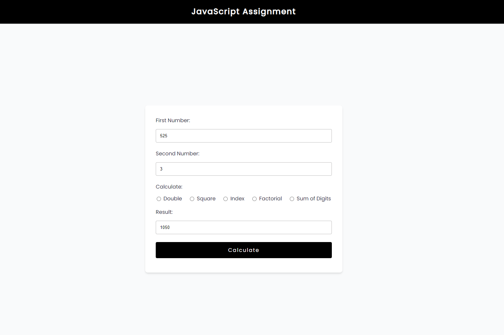

## Calculator - JavaScript Assignment

A calculator like app built with Vanilla Javascript where we can perform operations like squaring a number, finding it's double, it's factorial, and the sum of it's digits. This was a task for one of my frontend training assessment.

## Live Preview

[Simple Calculator - Live Demo](https://yodkwtf.github.io/calculator-javascript/)

## Preview

